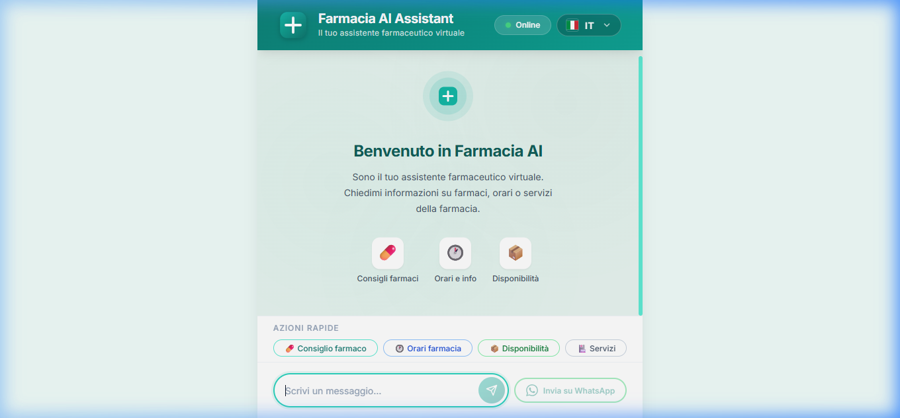
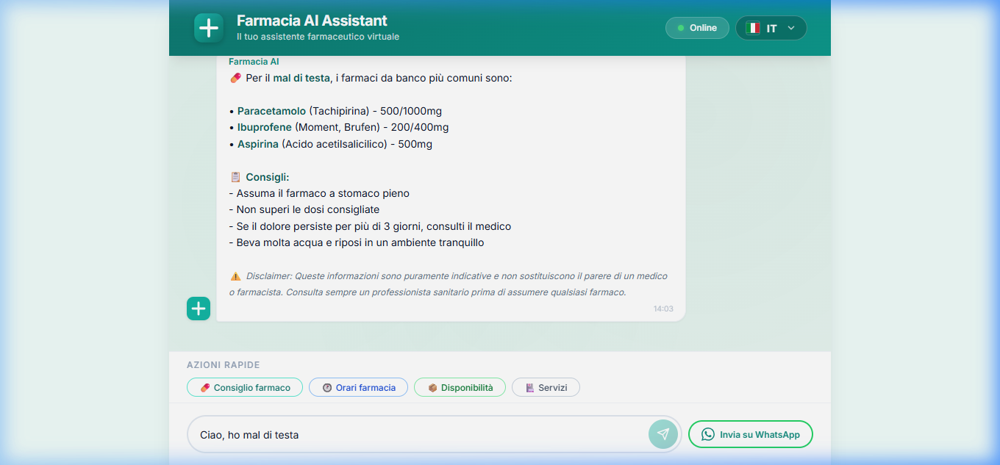

# Farmacia AI Assistant

Virtual pharmacy assistant with a modern web interface, Django backend, and React frontend. The project is designed to answer common symptom questions, guide users through product-related inquiries, and make it easier to continue the conversation on WhatsApp.

The chatbot primarily supports Italian and English, with offline fallback behavior when the backend or AI provider is unavailable.

## Overview

- Pharmacy chat with automated responses for common symptoms and routine questions.
- Basic language detection between Italian and English.
- Optional OpenAI integration.
- Offline mode with local responses when the API is unavailable.
- WhatsApp link generation for follow-up support.
- REST API for chat, history, and product catalog features.

## Screenshots

<p align="center">
  
</p>

<p align="center">
  
</p>

## Features

### Smart chat

- Answers questions about headaches, fever, cough, colds, allergies, and gastric discomfort.
- Includes safety disclaimers to reinforce that the content does not replace medical or pharmaceutical advice.
- Stores conversation history in the backend.

### User experience

- Responsive interface with quick actions.
- Typing indicator to simulate real-time assistance.
- Language switcher in the interface.
- Error banner with automatic offline fallback.

### Catalog and support

- API to list, search, and inspect pharmacy products.
- Support for filters by availability, category, and product name.
- WhatsApp link generation with a prefilled message.

## Stack

| Layer | Technology |
| --- | --- |
| Frontend | React 19 + Vite 8 |
| Backend | Django 4.2 + Django REST Framework |
| Database | SQLite in local development |
| Integrations | OpenAI API and WhatsApp link sharing |
| Styling | Plain CSS |

## Project Architecture

```text
famarcia_chatbot/
|-- backend/
|   |-- chatbot/          # chat, AI engine, history, and WhatsApp integration
|   |-- pharmacy/         # catalog and product endpoints
|   |-- config/           # Django settings and main routes
|   |-- db.sqlite3        # local development database
|   |-- manage.py
|   `-- requirements.txt
|-- frontend/
|   |-- public/
|   |-- src/
|   |   |-- components/   # application UI
|   |   |-- services/     # HTTP client for the API
|   |   `-- App.jsx       # main conversation state
|   `-- package.json
|-- docs/
|   |-- screenshot.png
|   `-- screenshot_chat.png
|-- LICENSE
|-- README.md
`-- SECURITY.md
```

## Getting Started

### Prerequisites

- Python 3.10 or later
- Node.js 18 or later
- npm
- Optional OpenAI API key

### 1. Clone the project

```bash
git clone https://github.com/kallebesiqueira-dev/famarcia_chatbot.git
cd famarcia_chatbot
```

### 2. Set up the backend

```bash
cd backend
python -m venv venv
```

On Windows:

```bash
.\venv\Scripts\activate
```

On macOS/Linux:

```bash
source venv/bin/activate
```

Install the dependencies and start the server:

```bash
pip install -r requirements.txt
python manage.py migrate
python manage.py runserver 8000
```

### 3. Set up the frontend

In another terminal:

```bash
cd frontend
npm install
npm run dev
```

### 4. Open in the browser

```text
http://localhost:5173
```

Vite is already configured to proxy `/api` requests to `http://127.0.0.1:8000` during development.

## Useful Scripts

From the project root:

```bash
npm run dev
```

Starts the frontend using the root script.

```bash
npm run dev:backend
```

Starts the backend using the Python interpreter from `backend/venv`.

```bash
npm run build
```

Builds the frontend for production.

## Environment Configuration

Create a `backend/.env` file if you want to override the default settings.

Example:

```env
DJANGO_DEBUG=True
DJANGO_SECRET_KEY=replace-this-key-in-production
DJANGO_ALLOWED_HOSTS=localhost,127.0.0.1
CORS_ALLOWED_ORIGINS=http://localhost:5173,http://127.0.0.1:5173

WHATSAPP_NUMBER=393331234567

AI_PROVIDER=mock
OPENAI_API_KEY=
AI_MODEL=gpt-4o-mini
AI_MAX_TOKENS=500
```

### AI modes

- `AI_PROVIDER=mock`: uses local backend responses without relying on an external provider.
- `AI_PROVIDER=openai`: uses the OpenAI API when `OPENAI_API_KEY` is defined.

If the backend fails or becomes unavailable, the frontend still replies with a local fallback to keep the experience functional.

## Database and Sample Data

The project uses SQLite by default in local development.

To populate the catalog with sample products:

```bash
cd backend
.\venv\Scripts\activate
python seed_data.py
```

This creates or updates products such as pain relievers, vitamins, cosmetics, and medical devices.

## API Endpoints

### Chat

| Method | Route | Description |
| --- | --- | --- |
| `POST` | `/api/chat/` | Sends a message and returns the assistant response |
| `GET` | `/api/chat/history/` | Returns the conversation history |

Example payload:

```json
{
  "message": "Ho mal di testa",
  "session_id": "session_123"
}
```

### Products

| Method | Route | Description |
| --- | --- | --- |
| `GET` | `/api/products/` | Lists products |
| `GET` | `/api/products/search/?q=term` | Searches products |
| `GET` | `/api/products/{id}/` | Returns product details |

Supported filters for `/api/products/`:

- `available=true`
- `category=farmaco`
- `search=paracetamolo`

### WhatsApp

| Method | Route | Description |
| --- | --- | --- |
| `POST` | `/api/whatsapp/` | Generates a WhatsApp link with a ready-to-send message |

## Application Flow

1. The user types a message in the frontend.
2. React sends the request to `/api/chat/`.
3. Django processes the text, detects the language, and generates a response.
4. The response is stored in history and returned to the frontend.
5. The user can continue the conversation or forward the latest reply to WhatsApp.

## Security

Read [SECURITY.md](SECURITY.md) before publishing the project or configuring sensitive variables in production.

## License

This project is licensed under the [MIT](LICENSE) license.
]]>
